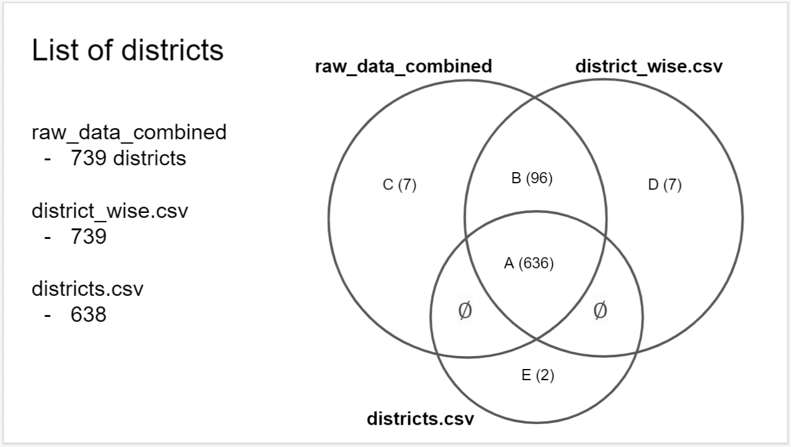
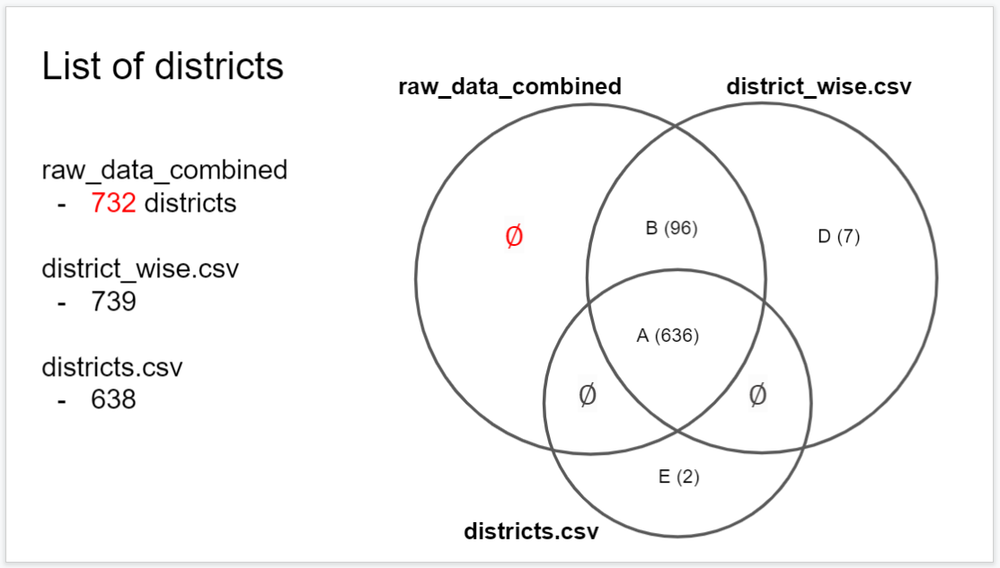

```{r setup, include=FALSE}
knitr::opts_chunk$set(echo = TRUE)
```


```{r message=FALSE}
#Load package and data
library(tidyverse)
library(here)
raw_data_combined <- read_csv(here("outcome/raw_data_combined.csv"))[,-1]
districts <- read_csv(here("outcome/downloads/districts.csv"))
district_wise <- read_csv(here("outcome/downloads/district_wise.csv"))[,-1]

states <- read_csv(here("outcome/downloads/states.csv"))
state_wise <- read_csv(here("outcome/downloads/state_wise.csv"))
state_wise_daily <- read_csv(here("outcome/downloads/state_wise_daily.csv"))
```
# Check 0.

In`raw_data_combined`, I found by chance that the district name 'Hamirpur' is in two states, which are 'Himachal Pradesh' and  'Uttar Pradesh'. Let's check if there are more those district names.

```{r}
#Get the list of those district names and the corresponding number of states that have the district.
raw_data_combined %>% group_by(detected_district, detected_state) %>% summarise(n = n()) %>%
  group_by(detected_district) %>% summarise(n = n()) %>% filter(n >1)
```

From the output above, it looks like there are two states having the district name Amravati. Also, two states having Aurangabad. Let's get the state names corresponding to those districts.
```{r}
#state names corresponding to districts
multiple_dist <- raw_data_combined %>% group_by(detected_district, detected_state) %>% summarise(n = n()) %>%
  group_by(detected_district) %>% summarise(n = n()) %>% filter(n >1)

multiple_dist$states <- NA
for (i in 1:nrow(multiple_dist)) {
  dist <- multiple_dist$detected_district[i]
  multiple_dist$states[i] <-
    raw_data_combined %>% group_by(detected_district, detected_state) %>% summarise(n = n()) %>%
    filter(detected_district == dist) %>% .$detected_state %>% list()
}

multiple_dist$states2 <- lapply(multiple_dist$states, function(x) paste0(x, collapse = ", ")) %>% 
  unlist()
multiple_dist
```

The following results show that the NAs in `states` for Amravati and Changlang are apparently error. Let's fill them.
```{r}
#The following two state values(NA) are apparently error.
raw_data_combined %>% group_by(detected_district, detected_state) %>% summarise(n = n()) %>%
  filter(detected_district == "Amravati")

raw_data_combined %>% group_by(detected_district, detected_state) %>% summarise(n = n()) %>%
  filter(detected_district == "Changlang")

#Let's fill them.
raw_data_combined[raw_data_combined$detected_district == "Amravati" &
                    !(is.na(raw_data_combined$detected_district))& 
                    is.na(raw_data_combined$detected_state),]$detected_state <- "Maharashtra"

raw_data_combined[raw_data_combined$detected_district == "Changlang" &
                    !(is.na(raw_data_combined$detected_district))& 
                    is.na(raw_data_combined$detected_state),]$detected_state <- "Arunachal Pradesh"

#Let's get the district names in multiple states again.
multiple_dist <- raw_data_combined %>% group_by(detected_district, detected_state) %>% summarise(n = n()) %>%
  group_by(detected_district) %>% summarise(n = n()) %>% filter(n >1)

multiple_dist$states <- NA
for (i in 1:nrow(multiple_dist)) {
  dist <- multiple_dist$detected_district[i]
  multiple_dist$states[i] <-
    raw_data_combined %>% group_by(detected_district, detected_state) %>% summarise(n = n()) %>%
    filter(detected_district == dist) %>% .$detected_state %>% list()# paste0(kk ,sep = " ", collapse="/ ")
}

multiple_dist$states2 <- lapply(multiple_dist$states, function(x) paste0(x, collapse = ", ")) %>% 
  unlist()

multiple_dist
```

# Clean district variables for the 3 datasets.

If district is not specified or missing, call it 'other'. In the variable label and list all reasons for the data being classified as other. If it's too long, then add it to the documentation and the RMarkdown. 

```{r}
dr <- unique(raw_data_combined$detected_district) #list of districts in 'raw_data_combined' : 823 districts.
dd <- unique(districts$District) #list of districts in 'districts.csv' : 638 districts.
ddw <- unique(district_wise$District) #list of districts in 'district_wise.csv' : 744 districts.

#Some districts are all upper case. Fix it.
dr <- tolower(dr) %>% str_to_title()
dd <- tolower(dd) %>% str_to_title()
ddw <- tolower(ddw) %>% str_to_title()

#To filter actual district, I used a list of districts of census 2011
district_c11 <- read_csv(here("3. census 2011/data_dist.csv"))
dc11 <- district_c11$dist_name

dr[!(dr %in% dc11)]
dd[!(dd %in% dc11)]
ddw[!(ddw %in% dc11)]
```

From the lists above, we can see that several values are not actual districts, which are Airport Quarantine, Railway Quarantine, Others, Other State, Other Region, State Pool, Foreign Evacuees, Evacuees, Unassigned, Unknown, and NA. Also, I found that district names saved as Italians are error from the API github forum : https://github.com/covid19india/covid19india-react/issues/808. Let's assign a same value for them. Let's call it 'Other'.

```{r}
districts_other <- c("Airport Quarantine", "Railway Quarantine", "Others", "Other State", "Other Region", "State Pool", "Foreign Evacuees", "Evacuees", "Italians","Unassigned", "Unknown") #list of districts values to be assigned as "Other".

#raw_data_combined
dr_full <- raw_data_combined$detected_district #districts of raw_data_combined.
raw_data_combined$detected_district <- tolower(dr_full) %>% str_to_title() #convert to lower case except for the first letter.
raw_data_combined[is.na(dr_full), ]$detected_district <- "Others" #assign 'Others' to NA's
raw_data_combined[raw_data_combined$detected_district %in% districts_other, ]$detected_district <- "Others"


#districts.csv
dd_full <- districts$District #districts of districts.csv.
districts$District <- tolower(dd_full) %>% str_to_title() #convert to lower case except for the first letter.
districts[is.na(dd_full), ]$District <- "Others" #assign 'Others' to NA's
districts[districts$District %in% districts_other, ]$District <- "Others"


#district_wise.csv
ddw_full <- district_wise$District #districts of district_wise.csv.
district_wise$District <- tolower(ddw_full) %>% str_to_title() #convert to lower case except for the first letter.
district_wise[is.na(ddw_full), ]$District <- "Others" #assign 'Others' to NA's
district_wise[district_wise$District %in% districts_other, ]$District <- "Others"
```

The district values have been pretty much organized now. However, there is one thing left to do. In Check 0., there were several district names included multiple states. Let's make the district names unique. For example, both states, Bihar and Maharashtra have district Aurangabad. We will assign district values as Aurangabad (Bihar) and Aurangabad (Maharashtra) for each state.

```{r}
#state names corresponding to districts
multiple_dist <- raw_data_combined %>% group_by(detected_district, detected_state) %>% summarise(n = n()) %>%
  group_by(detected_district) %>% summarise(n = n()) %>% filter(n >1)

multiple_dist$states <- NA
for (i in 1:nrow(multiple_dist)) {
  dist <- multiple_dist$detected_district[i]
  multiple_dist$states[i] <-
    raw_data_combined %>% group_by(detected_district, detected_state) %>% summarise(n = n()) %>%
    filter(detected_district == dist) %>% .$detected_state %>% list()
}

multiple_dist$states2 <- lapply(multiple_dist$states, function(x) paste0(x, collapse = ", ")) %>% 
  unlist()
multiple_dist
```

The table above says, Kishanganj in Assam, Mandi in Madhya Pradesh and Yadgir in Telangana exists. However, actually they are just errors. Let's remove those error rows first, and then make the actual duplicate district names unique.

```{r}
raw_data_combined <- raw_data_combined[!(raw_data_combined$detected_district == "Kishanganj" &
                      raw_data_combined$detected_state == "Assam"),]

raw_data_combined <- raw_data_combined[!(raw_data_combined$detected_district == "Mandi" &
                      raw_data_combined$detected_state == "Madhya Pradesh"),]

raw_data_combined <- raw_data_combined[!(raw_data_combined$detected_district == "Yadgir" &
                      raw_data_combined$detected_state == "Telangana"),]


multiple_dist <- raw_data_combined %>% group_by(detected_district, detected_state) %>% summarise(n = n()) %>%
  group_by(detected_district) %>% summarise(n = n()) %>% filter(n >1)

multiple_dist$states <- NA
for (i in 1:nrow(multiple_dist)) {
  dist <- multiple_dist$detected_district[i]
  multiple_dist$states[i] <-
    raw_data_combined %>% group_by(detected_district, detected_state) %>% summarise(n = n()) %>%
    filter(detected_district == dist) %>% .$detected_state %>% list()
}

multiple_dist$states2 <- lapply(multiple_dist$states, function(x) paste0(x, collapse = ", ")) %>% 
  unlist()
multiple_dist
```

We don't need to district names like 'Others (Andaman and Nicobar Islands)', 'Others (Andhra Pradesh)',... 

```{r}
multiple_dist <- multiple_dist[multiple_dist$detected_district != 'Others',]
```

Now make the district names unique.

```{r}
for (i in 1:nrow(multiple_dist)){
  dist <- multiple_dist$detected_district[i]
  state_list <- multiple_dist$states[[i]]
  
  for (state in state_list){
    raw_data_combined[which(raw_data_combined$detected_district==dist &
                          raw_data_combined$detected_state == state),]$detected_district <-
      paste0(dist, ' (', state, ')')
    }
  }
```

Repeat the same work for `districts.csv` and `district_wise.csv`.

```{r}
#districts.csv
#Combine non unique district names.
multiple_dist <- districts %>% group_by(District, State) %>% summarise(n = n()) %>%
  group_by(District) %>% summarise(n = n()) %>% filter(n >1)

#Make states column
multiple_dist$states <- NA
for (i in 1:nrow(multiple_dist)) {
  dist <- multiple_dist$District[i]
  multiple_dist$states[i] <-
    districts %>% group_by(District, State) %>% summarise(n = n()) %>%
    filter(District == dist) %>% .$State %>% list()
}

multiple_dist$states2 <- lapply(multiple_dist$states, function(x) paste0(x, collapse = ", ")) %>% 
  unlist()
multiple_dist

#Remove rows having 'Others'
multiple_dist <- multiple_dist[multiple_dist$District != 'Others',]
multiple_dist

#Assign unique district names.
for (i in 1:nrow(multiple_dist)){
  dist <- multiple_dist$District[i]
  state_list <- multiple_dist$states[[i]]
  
  for (state in state_list){
    districts[which(districts$District==dist &
                          districts$State == state),]$District <-
      paste0(dist, ' (', state, ')')
    }
  }
```

```{r}
#district_wise.csv
#Combine non unique district names.
multiple_dist <- district_wise %>% group_by(District, State) %>% summarise(n = n()) %>%
  group_by(District) %>% summarise(n = n()) %>% filter(n >1)

#Make states column
multiple_dist$states <- NA
for (i in 1:nrow(multiple_dist)) {
  dist <- multiple_dist$District[i]
  multiple_dist$states[i] <-
    district_wise %>% group_by(District, State) %>% summarise(n = n()) %>%
    filter(District == dist) %>% .$State %>% list()
}

multiple_dist$states2 <- lapply(multiple_dist$states, function(x) paste0(x, collapse = ", ")) %>% 
  unlist()
multiple_dist

#Remove rows having 'Others'
multiple_dist <- multiple_dist[multiple_dist$District != 'Others',]
multiple_dist

#Assign unique district names.
for (i in 1:nrow(multiple_dist)){
  dist <- multiple_dist$District[i]
  state_list <- multiple_dist$states[[i]]
  
  for (state in state_list){
    district_wise[which(district_wise$District==dist &
                          district_wise$State == state),]$District <-
      paste0(dist, ' (', state, ')')
    }
  }
```

# Make the list of districts and compare them. 

```{r}
dr <- unique(raw_data_combined$detected_district) #list of districts in 'raw_data_combined' : 739 districts.
dd <- unique(districts$District) #list of districts in 'districts.csv' : 638 districts.
ddw <- unique(district_wise$District) #list of districts in 'district_wise.csv' : 739 districts.
```



```{r}
A <- intersect(dr, dd) %>% intersect(ddw)
A

B <-intersect(dr, ddw)[!(intersect(dr, ddw) %in% A)]
B

C <- dr[!(dr %in% c(dd, ddw))]
C

D <- ddw[!(ddw %in% c(dr, dd))]
D

E <- dd[!(dd %in% c(dr, ddw))]
E
```

The districts in C, let's check if they are actual districts or just typos. 

```{r}
raw_data_combined %>% filter(detected_district== 'Lmora') # -> ALmora or remove
raw_data_combined %>% filter(detected_district== 'Kamrup Rural')# -> Kamrup
raw_data_combined %>% filter(detected_district== 'Tengunoupal')# -> Tengnoupal
raw_data_combined %>% filter(detected_district== 'Saraikela')# -> Saraikela-Kharsawan or remove.
raw_data_combined %>% filter(detected_district== 'Bokara')#-> Bokaro or remove
raw_data_combined %>% filter(detected_district== 'Gamla')# -> Gumla or remove
raw_data_combined %>% filter(detected_district== 'Tinsukla')# -> Tinsukia
```
The results above show that th districts in C are all  typos. For example, 'Tinsukla' should've been coded as 'Tinsukia'. If you check 'Tinsukia' rows in `raw_data_combined`, you can see that data on 07/06/2021 and 08/06/2021 are ommited because they are coded as 'Tinsukla'. Let's fix them.

```{r}
raw_data_combined <- raw_data_combined[which(raw_data_combined$detected_district != 'Lmora'),]
raw_data_combined[which(raw_data_combined$detected_district == 'Kamrup Rural'),]$detected_district <-
  'Kamrup'
raw_data_combined[which(raw_data_combined$detected_district == 'Tengunoupal'),]$detected_district <-
  'Tengnoupal'
raw_data_combined <- raw_data_combined[which(raw_data_combined$detected_district != 'Saraikela'),]
raw_data_combined <- raw_data_combined[which(raw_data_combined$detected_district != 'Bokara'),]
raw_data_combined <- raw_data_combined[which(raw_data_combined$detected_district != 'Gamla'),]
raw_data_combined[which(raw_data_combined$detected_district == 'Tinsukla'),]$detected_district <-
  'Tinsukia'
```
 The lists of districts should be like these :
 


```{r}
dr <- unique(raw_data_combined$detected_district) #list of districts in 'raw_data_combined' : 732 districts.
dd <- unique(districts$District) #list of districts in 'districts.csv' : 638 districts.
ddw <- unique(district_wise$District) #list of districts in 'district_wise.csv' : 739 districts.

A <- intersect(dr, dd) %>% intersect(ddw)
B <-intersect(dr, ddw)[!(intersect(dr, ddw) %in% A)]
C <- dr[!(dr %in% c(dd, ddw))]
D <- ddw[!(ddw %in% c(dr, dd))]
E <- dd[!(dd %in% c(dr, ddw))]
```

Let's see what data in D and E look like.

```{r}
#D
district_wise %>% filter(District %in% D) %>% .[,c(1:8, 14)]
```

```{r}
# E
districts %>% filter(District =='Delhi') %>% nrow()
districts %>% filter(State =='Delhi') %>% nrow()
```

The numbers between rows with state 'Delhi' and district 'Delhi' are the same. That means district level data of Dellhi is not organized in `districts`. Is district-wise data in Delhi collected in `raw_data_combined`? Actually, not. If you run the following code, you can check that district-level data hasn't been collected since 06/05/2020.

```{r, eval = F}
raw_data_combined %>% filter(detected_state == "Delhi") %>% View()
raw_data_combined %>% filter(detected_state == "Delhi" &
                               detected_district != 'Others') %>% View()
```


```{r}
# E
districts %>% filter(District =='Capital Complex') %>% head(30) # No COVID cases...?
```


 Highlight districts that are missing across the datasets for all combinations of the three datasets. The full list of states and districts will be loaded and saved as `lists`. This data is from https://www.askbankifsccode.com/blog/list-of-all-states-union-territories-and-districts-in-india/ . First, I will make the duplicated district names unique as above.

```{r}
lists <- read_csv(here("outcome/Indian-States-and-Districts-List.csv"))
lists %>% group_by(District) %>% summarise(n = n()) %>% filter(n > 1)

multiple_dist <- lists %>% group_by(District) %>% summarise(n = n()) %>% filter(n > 1)

#Make states column
multiple_dist$states <- NA
for (i in 1:nrow(multiple_dist)) {
  dist <- multiple_dist$District[i]
  multiple_dist$states[i] <-
    lists %>% group_by(District, State) %>% summarise(n = n()) %>%
    filter(District == dist) %>% .$State %>% list()
}

multiple_dist$states2 <- lapply(multiple_dist$states, function(x) paste0(x, collapse = ", ")) %>% 
  unlist()
multiple_dist

#Assign unique district names.
for (i in 1:nrow(multiple_dist)){
  dist <- multiple_dist$District[i]
  state_list <- multiple_dist$states[[i]]
  
  for (state in state_list){
    lists[which(lists$District==dist &
                          lists$State == state),]$District <-
      paste0(dist, ' (', state, ')')
    }
}
```

```{r}
dc <- unique(c(dr, dd, ddw)) #districts of all combinations of the three.
length(dc)
intersect(dc, lists$District) %>% length()
dc[!(dc %in% lists$District)]
```

Some districts have multiple names. To match the subtle differences of district names, I added a new column 'District2' in "outcome/Indian-States-and-Districts-List.csv".

```{r}
dc[!(dc %in% lists$District) & !(dc %in% lists$District2)]
```

List of districts that are missing across the datasets for all combinations of the three datasets is as follows.

```{r}
lists$District[!(lists$District %in% dc) & !(lists$District2 %in% dc)]
```


# Check how different values in `raw_data_combined` and `districts.csv`.

Make a table that shows the percentage difference for the categories(Hospitalized, Recovered or Deceased). Let's make the table and save it as `diff`. The list of districts that are contained in both `raw_data_combined` and `districts.csv` is saved in `A`. However, district 'Others' will not be used.

```{r}
A_ <- A[A != 'Others'] # A except 'Others'
len <- length(A_)

diff <- data.frame(A_, ExactSame = rep(NA, len), Hospitalized_raw = rep(NA, len), 
                   Recovered_raw = rep(NA, len), Deceased_raw = rep(NA, len),
                   
                   Hospitalized_districts = rep(NA, len), Recovered_districts = rep(NA, len),
                   Deceased_districts= rep(NA, len),
                   
                   Hospitalized_perdiff = rep(NA, len), Recovered_perdiff = rep(NA, len),
                   Deceased_perdiff = rep(NA, len))

for (i in 1: nrow(diff)){
  dist <- diff[i,1]
  
  cases_districts <- districts %>% filter(District == dist) %>% tail(1) %>% .[,c(4:6)]
  
  cases_raw <- c(
    raw_data_combined %>% filter(detected_district == dist, current_status == "Hospitalized") %>%
    .$num_cases %>% sum(na.rm = TRUE),
    
    raw_data_combined %>% filter(detected_district == dist, current_status == "Recovered") %>%
    .$num_cases %>% sum(na.rm = TRUE),
    
    raw_data_combined %>% filter(detected_district == dist, current_status == "Deceased") %>%
    .$num_cases %>% sum(na.rm = TRUE)
    )
  
  cases_diff <- cases_districts - cases_raw
  
  diff[i,2] <- all(cases_diff==0)
  
  diff[i, 3:5] <- cases_raw
  diff[i, 6:8] <- cases_districts
  diff[i, 9:11] <- cases_diff/cases_raw * 100
}
```

For several districts, deceased cases are both zero in `raw_data_combined` and `districts`. 0/0 returns NaN in R. Since that means exact match between the two data sets, I will change NaN in `Deceased_perdiff` to 0.

```{r}
tail(diff) #When Deceased_raw and Deceased_districts are both 0, Deceased_perdiff is NaN.

#Let's change NaN to 0.
diff[is.nan(diff$Deceased_perdiff), ]$Deceased_perdiff <- 0
```

Out of the 635 districts, how many districts have the same number of cases for the three categories? 
```{r}
sum(diff$ExactSame == TRUE)
```

Out of the 327(=635-308) districts, which districts have the maximal percentage differences for the three categories?

```{r}
diff[which(abs(diff$Hospitalized_perdiff) == max(abs(diff$Hospitalized_perdiff))),]
diff[which(abs(diff$Recovered_perdiff) == max(abs(diff$Recovered_perdiff))),]
diff[which(abs(diff$Deceased_perdiff) == max(abs(diff$Deceased_perdiff))),]
```
Churachandpur, Dibrugarh, and Udalguri has 0 for the three categories, so they have the maximal differences. What if we exclude them and see which distircts have the biggest differences?

```{r}
diff2 <- diff[!(diff$A_ %in% c("Churachandpur", "Dibrugarh", "Udalguri")), ] #exclude the three districts.

#Five districts with the largest percentage difference of 'Hospitalized'
diff2 %>% arrange(desc(Hospitalized_perdiff)) %>% head(5)
#Five districts with the largest percentage difference of 'Recovered'
diff2 %>% arrange(desc(Recovered_perdiff)) %>% head(5)
#Five districts with the largest percentage difference of 'Deceased'
diff2 %>% arrange(desc(Deceased_perdiff)) %>% head(5)
```
Kalimpong has the largest percentage difference for hospotalized cases, and it's 0.13%. For the recovered cases, Nuh has the biggest difference with 0.81%. The differences were more significant in the deceased cases. Dewas shows 13.3% differences.

# Check which districts in `district_wise` have the warning message

(District-wise numbers are out-dated as cummulative counts for each district are not reported in bulletin or have complete 0 count across all categories.) Make note of which states these districts belong to. Check if COVID numbers for those districts are reported in `raw_data_combined` and `districts`. Even though the numbers are reported, check if there is any note for those districts.
   
```{r}
#See messages in District_Notes
unique(district_wise$District_Notes)

#Messages we want to focus on :
mes <- c("District-wise numbers are out-dated as cumulative counts for each district are not reported in bulletin", "District-wise numbers are out-dated as cumulative counts for each district are not reported in Telangana bulletin")

district_wise %>% filter(District_Notes %in% mes)

```

We can see that districts in Andaman and Nicobar Islands, Delhi, Goa, or Telangana have the message. Also, all districts in the states have the message.

```{r}
states_mes <- c("Andaman and Nicobar Islands", "Delhi", "Goa", "Telangana")
district_wise %>% filter(State %in% states_mes)
```

Hasn't data of those districts really been collected? If you run the following code, you can check that the data of districts in Andaman and Nicobar Islands hasn't been collected since 11/06/2020. Also, the districts in Delhi and Goa don't have up-to-date data since 07/05/2020 and 30/08/2020. However, it looks like districts in Telangana are up-to-date.

```{r, eval = F}
raw_data_combined %>% filter(detected_state == "Andaman and Nicobar Islands") %>% View()
raw_data_combined %>% filter(detected_state == "Andaman and Nicobar Islands" &
                               detected_district != 'Others') %>% View()

raw_data_combined %>% filter(detected_state == "Delhi") %>% View()
raw_data_combined %>% filter(detected_state == "Delhi" &
                               detected_district != 'Others') %>% View()

raw_data_combined %>% filter(detected_state == "Goa") %>% View()
raw_data_combined %>% filter(detected_state == "Goa" &
                               detected_district != 'Others') %>% View()

raw_data_combined %>% filter(detected_state == "Telangana") %>% View()
raw_data_combined %>% filter(detected_state == "Telangana" &
                               detected_district != 'Others') %>% View()
```

For the list of districts in `B`, are they included in one of the states above(Andaman and Nicobar Islands, Delhi, Goa, or Telangana)? The districts in `B` are removed in `districts` because of their out-dated data? Not every district. They are inlcuded in one of the following states : (Andaman and Nicobar Islands, Delhi, Goa, Telangana, Assam, Manipur, or Sikkim)
```{r}
B[!(B %in% c(lists$District, lists$District2))]
lists[lists$District %in% B | lists$District2 %in% B , ]
lists[lists$District %in% B | lists$District2 %in% B , ]$State %>% unique()
```

It looks like districts in Assam, Manipur, or Sikkim are excluded in `districts` for no reason.

```{r, eval = F}
raw_data_combined %>% filter(detected_state == "Assam") %>% View()
raw_data_combined %>% filter(detected_state == "Assam" &
                               detected_district != 'Others') %>% View()

raw_data_combined %>% filter(detected_state == "Manipur") %>% View()
raw_data_combined %>% filter(detected_state == "Manipur" &
                               detected_district != 'Others') %>% View()

raw_data_combined %>% filter(detected_state == "Assam") %>% View()
raw_data_combined %>% filter(detected_state == "Assam" &
                               detected_district != 'Others') %>% View()
```